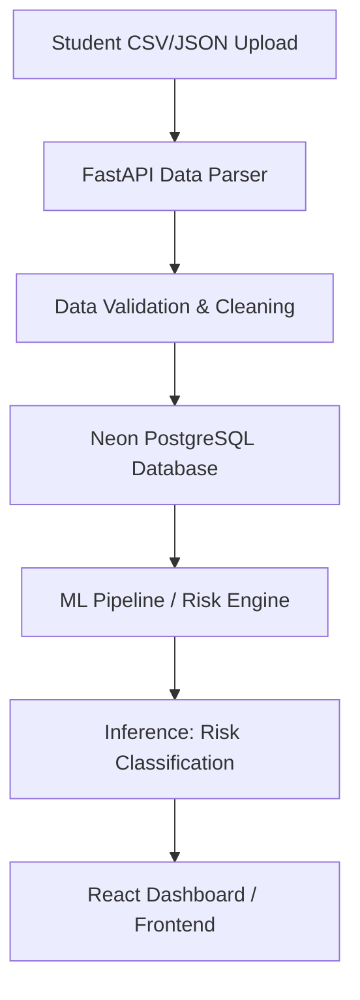

# Student Early Warning System (EWS)

A full-stack predictive analytics platform designed to identify students at risk of academic difficulty or dropout. By integrating historical academic records, attendance logs, and engagement metrics, the platform processes student data through a machine learning pipeline to generate actionable risk scores and top contributing factors. This enables educational administrators to initiate timely, targeted interventions.

## 🚀 Key Features

* **Real-time Risk Dashboard**: Displays institutional KPIs, risk distribution charts, and student enrollment trends.
* **Predictive Risk Engine**: Employs ML models (XGBoost, CatBoost, and Scikit-learn) to classify student risk categories (High, Medium, Low) and extract explainable feature importances.
* **Bulk Data Ingestion**: Features an automated parser that processes student records, academic performance sheets, and attendance CSVs with comprehensive validation.
* **Student Intervention Tracker**: Tracks past intervention plans, academic standing, and alerts.
* **Dual Database Adaptability**: Configured for PostgreSQL (Neon Serverless) and Supabase client bindings.

---

## 🛠️ Tech Stack

* **Frontend**: React 18, TypeScript, TailwindCSS, Vite, Lucide Icons, Axios.
* **Backend**: FastAPI (Python), Uvicorn, PostgreSQL client (Psycopg2).
* **Machine Learning**: XGBoost, CatBoost, Scikit-Learn, Pandas, NumPy, Pickle.
* **Deployment**: Configured for Vercel (Frontend), Render (Backend), and Neon/Supabase (Database).

---

## 📂 Repository Structure

```text
├── AT risk student/
│   ├── project/
│   │   ├── backend/               # FastAPI Server, Risk Engine & ML pipelines
│   │   │   ├── database.py        # Database pooling and client connections
│   │   │   ├── risk_engine.py     # ML inference and feature importances
│   │   │   ├── main.py            # FastAPI endpoints and route handlers
│   │   │   └── run.py             # Uvicorn server entrypoint
│   │   ├── src/                   # React Frontend application
│   │   │   ├── components/        # Reusable UI & Chart components
│   │   │   ├── contexts/          # Auth context and global states
│   │   │   ├── pages/             # Dashboard, Upload, Profiles, Settings pages
│   │   │   └── lib/               # Supabase and API clients
│   │   ├── supabase/              # SQL schemas and RLS migrations
│   │   └── vercel.json            # Vercel hosting rules
└── README.md                      # Project documentation
```

---

## ⚙️ Local Development Setup

### Prerequisite
* Python 3.10+
* Node.js 18+

### 1. Database Setup
Create database schemas on Supabase or Neon using the scripts in `project/supabase/migrations/`.

### 2. Backend Setup
1. Navigate to the backend directory:
   ```bash
   cd "AT risk student/project/backend"
   ```
2. Create and activate a Python virtual environment:
   ```bash
   python -m venv venv
   # On Windows:
   .\venv\Scripts\activate
   # On macOS/Linux:
   source venv/bin/activate
   ```
3. Install dependencies:
   ```bash
   pip install -r requirements.txt
   ```
4. Create a `.env` file based on `.env.example` and add database connection strings.
5. Launch the backend server:
   ```bash
   python run.py
   ```
   The API will be available at `http://127.0.0.1:8006` with interactive documentation at `http://127.0.0.1:8006/docs`.

### 3. Frontend Setup
1. Navigate to the project directory:
   ```bash
   cd "AT risk student/project"
   ```
2. Install npm dependencies:
   ```bash
   npm install
   ```
3. Launch the development server:
   ```bash
   npm run dev
   ```
   The application will be served locally at `http://localhost:5173/`.

---

## 📈 Architecture & Data Flow



1. **Ingestion**: Administrators upload raw academic and attendance sheets through the interface.
2. **Database storage**: Cleaned datasets are persisted in the Neon Serverless PostgreSQL instances.
3. **ML Inference**: When viewing a profile, the backend pulls the student's metrics, feeds them to the ensemble models, and computes the risk tier along with the primary risk indicators (e.g., low attendance, failing midterms).
4. **Visualization**: The React UI renders risk metrics using responsive charts.
